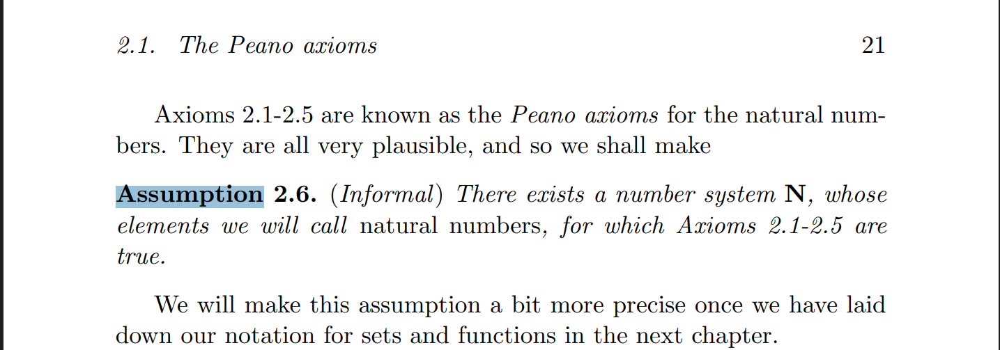

**Câu hỏi 1**: Thế nào là phương trình toán học ?   

**Câu hỏi 2**: AMS là gì ? 

_ AMS: American Mathematical Society (Hiệp hội toán học Hoa Kỳ) là một hiệp hội [các nhà toán học](https://en.wikipedia.org/wiki/Mathematician "Nhà toán học")(mathematician) chuyên nghiệp tận tâm với lợi ích của nghiên cứu và học thuật [toán học](https://en.wikipedia.org/wiki/Mathematics "Toán học") (mathematical), và phục vụ cộng đồng trong nước và quốc tế thông qua các ấn phẩm, hội nghị, hoạt động vận động và các chương trình khác.[^1]

**Vấn đề 3**: Các thuật ngữ Anh - Việt  bài học **"Định nghĩa, định lý, ..vv.."**

+ Vấn đề (problems): 
+ Tiên đề (axiom): 
+ Định lý (theorem): 
+ Định nghĩa (definition): 
+ Bổ đề (lemma): 
+ Mệnh đề (proposition):
+ Giải thiết (conjecture): 
+ Giả định (assumptions): 

	

nguồn: https://turan-edu.uz/media/books/2024/05/28/1664976801.pdf

+ Hệ quả (corollary): 
+ Nhận xét (remark): 
+ Điều kiện (conditions): 
+ Chứng minh (proof): 

**Vấn đề 4**: Gợi ý từ viết tắt cho bài học **"Định nghĩa, định lý, ..vv.."**

	 

**Vấn đề 4**: Toán tử trong toán học là gì ? 

. . . 

Các toán tử trong toán học:
+ Toán tử số học (Arithmetic Operators): +, - 
+ Toán tử quan hệ (Relational Operators): >, < 

--- 

[^1]: Nguồn tham khảo từ Wiki: https://en.wikipedia.org/wiki/American_Mathematical_Society 
